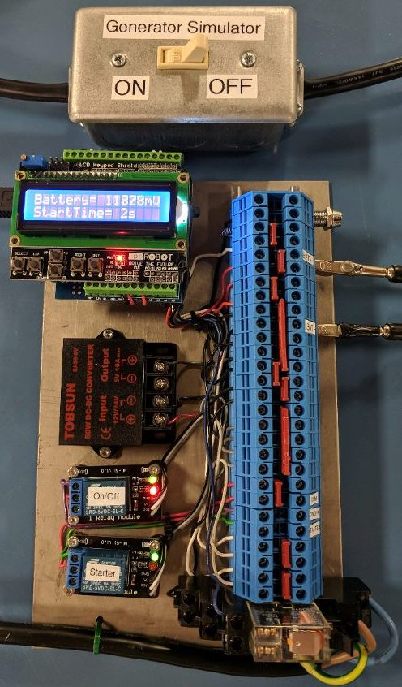

#  Automatic Generator Battery Backup Charger 

### Description

Automatic Generator Battery Backup Charger (or simply `BBC`, as we call it) is a hardware system regualated by an Adruino microcontroller. 
The `BBC` connects to general purpose generators and monitors the charge of the internal battery. When the charge of the battery drops below a certain threshold (`11.5V`), the `BBC` attempts to automatically fire-up the generator for a user specified amount of time. Once the charge on the internal battery reaches a separate threshold (`14V`), the `BBC` turns off the generator and waits for the voltage to deplete again, and repeats. 
An LCD shield display shows live information about the charge of the internal battery and allows the user to control the starter time. If the attached generator does not start within the alotted amount of time and iterations, the `BBC` system displays an error message (`Starter Failure!`) and the system must be reset. This is to reduce the likelyhood of the starter and generator from burning out.

### Hardware Used

* [Arduino Uno](https://store.arduino.cc/usa/arduino-uno-rev3)
* [Arduino LCD Shield](https://www.dfrobot.com/wiki/index.php/Arduino_LCD_KeyPad_Shield_(SKU:_DFR0009))
* [SUPERNIGHT (12V~24V DC) to (5V, 10A DC) 50W Converter](https://www.newegg.com/Product/Product.aspx?Item=0SW-004G-000B9)
* 2 5V Relays
* 1 120V AC Relay
* 1 xV Red LED
* Connecting Copper Wires
* whatever those blue connecty things are called
* the power supply

### Acknowledgements

 *Dr. Micheal A. Baswell.* Project mentor and professor.

 *Zachary M. O'Dell.* Offical team leader. Team logistics manager. Meeting scheduler. Software implementation designer.

 *Jonathan A. Gibson.* Assistant team leader. File system manager and organizer. Software researcher. Software tester. Website designer.

 *Joshua P. Adair.* Arduino researcher. Software researcher. Software implementation designer.

 *Naveen M. Chulani.* Hardware reseacher. Presentation leader.

 *Clinton C. Iyizoba.* Hardware researcher. Assistant presentation leader.

 *Fahmi I. Hashi.* Hardware implementation designer. Hardware tester.

 *Jeff C. Tilley.* Hardware implementation designer. Hardware tester. CAD diagram designer.

 

> Special thanks to Tennessee Technological University and the Electrical & Computer Engineering department for sponsoring this project.
