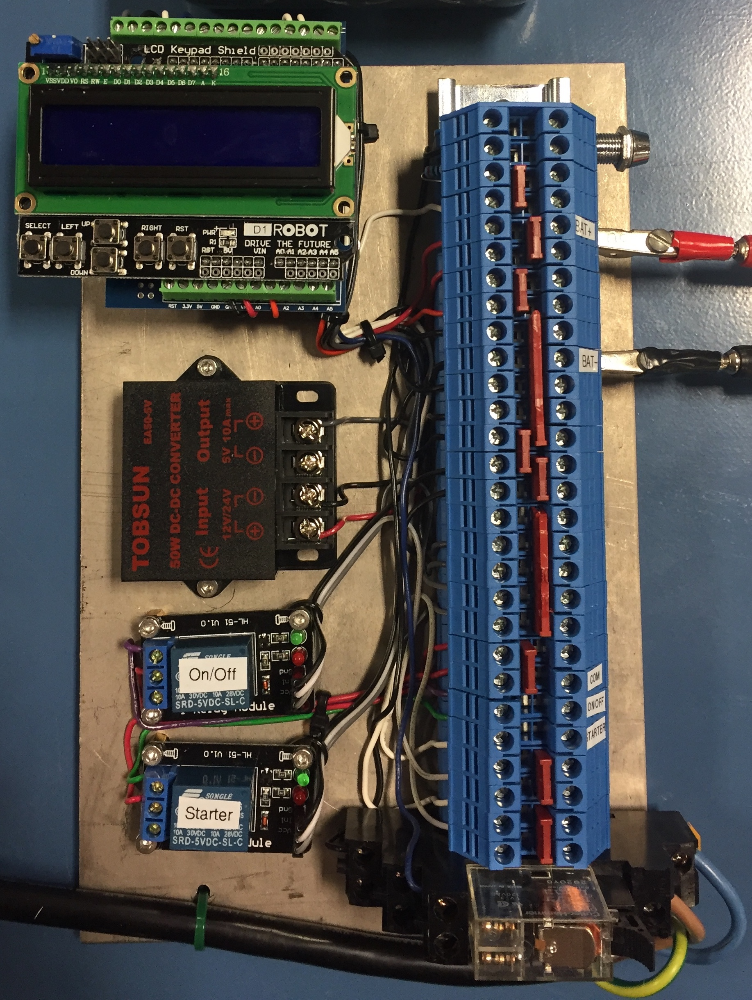
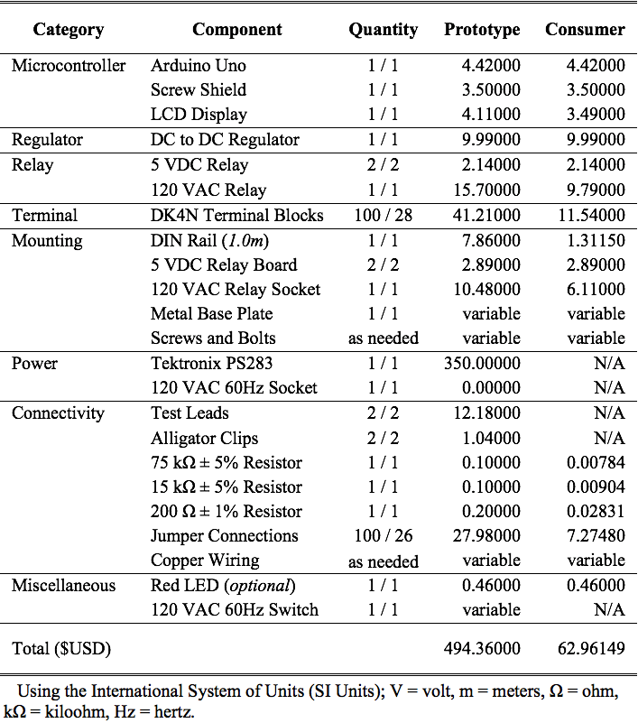

#  Automatic Generator Battery Backup Charger 

### Objective

Our project objective was to create a cheaper hardware version of an automatic generator backup controller for an external battery than what already exists on the open market. The hardware controller should automatically start and stop a generator based on the current external battery’s voltage levels. The generator should automatically charge the battery when the voltage drops below a certain threshold value. The generator should automatically turn off when the external battery is sufficiently charged.

### Description

The Automatic Generator Battery Backup Controller (or simply `BBC`, as we call it) is a hardware system regulated by an [Arduino Uno Microcontroller](https://store.arduino.cc/usa/arduino-uno-rev3) and controlled by an Arduino compatible [Liquid Crystal Display](https://en.wikipedia.org/wiki/Liquid-crystal_display) (LCD). The `BBC` system can help those who depend on solar power, especially those in developing nations. It eliminates the need to manually start and stop a generator, making the generator more convenient and efficient. 

The `BBC` system connects to general purpose generators and monitors an external battery's voltage. When the external battery's voltage drops below a user specified threshold `(11.0V ~ 12.0V)`, the `BBC` system activates the generator's starter, for a user specified amount of time `(2.0s ~ 3.0s)`, in an attempt to power on the generator. If the generator successfully starts and the external battery's voltage reaches a separate user specified threshold `(13.0V ~ 14.0V)`, the `BBC` system powers off the generator and waits for the external battery's voltage to deplete again, then repeats. If the generator fails to power on, the `BBC` system delays for a user specified amount of time `(20s ~ 60s)`, before activating the generator's starter again. The `BBC` system is only allowed three iterations of failed starter attempts in succession before displaying an error and taking appropriate action. 

An [Arduino Compatible Keypad Shield Display](https://www.banggood.com/Keypad-Shield-Blue-Backlight-For-Arduino-Robot-LCD-1602-Board-p-79326.html) shows a main menu with live information about the external battery's voltage and allows the user to adjust the system parameters (minimum and maximum generator threshold voltages, the between-iteration delay time, and the generator's starter duration). If the attached generator does not power on within the allotted amount of starter time and iterations, the `BBC` system displays an error message ("Starter Failure!"), lights up the red [Light Emitting Diode](https://en.wikipedia.org/wiki/Light-emitting_diode) (LED) indicator, and halts itself to be reset. The `BBC` system reset feature is to help prevent burn-out of the starter or generator during operation. 

At any time while viewing the main menu, a user can toggle the system's automation status or adjust the system parameters. Using the `UP` and `DOWN` buttons on the LCD keypad allows the user to set/toggle the automation status, determining if the system should automatically try to start and stop the generator, or not. This feature is useful during system maintenance and any executive reasons for system stagnation. Using the `LEFT` and `RIGHT` buttons on the LCD allows the user to specify all the aforementioned system parameters. These values are moderately variable to give the user a more dynamic and optimized controller for their particular generator. At any time within the parameter selection menu, the user can press `SELECT` to immediately leave the parameter selection menu and set all the parameter values to their current or changed states without needing to scroll through each parameter unnecessarily. The parameter selection feature also uses on-board [Electronically Erasable Programmable Read-Only Memory](https://en.wikipedia.org/wiki/EEPROM) (EEPROM) to read and set the parameter values. This feature persists parameter values through menu changes, system resets, and power outages to easily keep optimized settings. 

The `BBC` system also has a feature that turns off the LCD display after 10 or more seconds of user inactivity (not pressing any of the buttons on the LCD keypad). When the LCD is off and the user presses `SELECT`, the LCD turns on and the system returns to its current state. If the user has set the automation status to "ON", the system will run as normal in the background, even if the LCD is off. This inactivity feature is useful to save power/energy over the lifespan of the `BBC` system, to help prevent burn-out of the LCD, and to help prevent unintentional system manipulation from outside sources. 

### Hardware Used

| Hardware Implementation                        | Prototype vs. Optimized Consumer Cost 1, 2, 3|
|:----------------------------------------------:|:-------------------------------------------------:|
|   |    |

### Software Used

| Software                                              | Purpose  |
|:-----------------------------------------------------:|:---------|
|       |[Arduino IDE](https://www.arduino.cc/en/Main/Software) For modifying, uploading, and testing software for the BBC system.|
|       |[AutoCAD](https://www.autodesk.com/products/autocad/overview) For designing and drafting official pinout diagrams to represent the BBC system.|
|       |[draw.io](https://www.draw.io/) For designing and drafting overview connection diagrams to represent the BBC system.|
|        |[GitHub](https://github.com/) For organizing and storing all backups of and committing changes to all BBC project source code.|
|   |[Google Apps](https://apps.google.com/user/hub) For creating, sharing, storing, and managing files amongst all team members for the BBC project.|
|        |[Heroku](https://dashboard.heroku.com/) For publically creating, deploying, and testing the BBC project homepage website.|
|           |[Ruby on Rails](https://rubyonrails.org/) For locally designing, creating, and testing the BBC project homepage website.|

### Meet the Team

| Member                                                | Responsibilities|
|:-----------------------------------------------------:|:----------------|
|    |**Zachary M. O'Dell.** Offical team leader. Team logistics manager. Meeting scheduler. Software implementation designer.   |
|   |**Jonathan A. Gibson.** Assistant team leader. File system manager and organizer. Software researcher. Software tester. Website designer.   |
|    |**Joshua P. Adair.** Arduino researcher. Software researcher. Software implementation designer.   |
|  |**Naveen M. Chulani.** Hardware reseacher. Presentation leader.   |
|  |**Clinton C. Iyizoba.** Hardware researcher. Assistant presentation leader.   |
|    |**Fahmi I. Hashi.** Hardware implementation designer. Hardware tester.   |
|   |**Jeff C. Tilley.** Hardware implementation designer. Hardware tester. CAD diagram designer.   |

### Notes

	1. Prototype total cost was calculated based on the assumption that no hardware components are/were previously owned and that every component must be purchased individually.
	 
	2. Actual prototype total cost was free of charge. All hardware components were readily available and provided by Tennessee Technological University ( TTU ) , the Electrical & Computer Engineering ( ECE ) department, and Dr. Michael A. Baswell.
	 
	3. Optimized consumer total cost was calculated based on the assumption that all hardware could be bought at wholesale price and that no testing components needed to be purchased or used. Wholesale quantity is upwards of 1000+ units for some components.

### Acknowledgment

> This work was sponsored and financially supported by Tennessee Technological University (TTU), the Electrical & Computer Engineering (ECE) Department, and Dr. Michael A. Baswell.

[

](https://www.tntech.edu)

